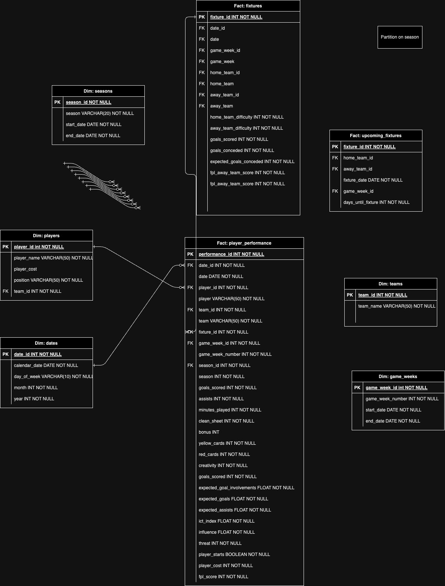

# Fantasy Premier League Dashboard

## About This Project

### Why this project?
- Real-World Application: ...
- Comprehensive Tech Stack: ...
- Hands-On Learning: ...
- Personal Interest: ...

### Key Features & Learnings:
- ETL...
- Object Storage (data lake)...
- Visualization with Streamlit...
- Data quality...
- Orchestration with Prefect...
- Postgres
- Data Modeling for analytics (Star schema) with DBT

### Techologies, Tools, and Frameworks:
This project leverages a range of open-source technologies including MinIO, DBT,
- Dataflow / architecture diagram
- 

## Future Improvements/Opportunities
- Refactor ingestions into modular components
- Machine Learning Pipeline to predict:
  - Total current optimal team
  - Optimal pick based on current team
  - Skills:
    - ML Models (Sklearn)
    - MLFlow (ML pipelines)
    - Feature engineering
- 

## WIP Logical Data Modeling

# Sources
- https://github.com/neelthakurdas/fpl_points_predictor/blob/main/fpl_points_predictor.ipynb 
- https://github.com/vaastav/Fantasy-Premier-League/tree/master 
- 